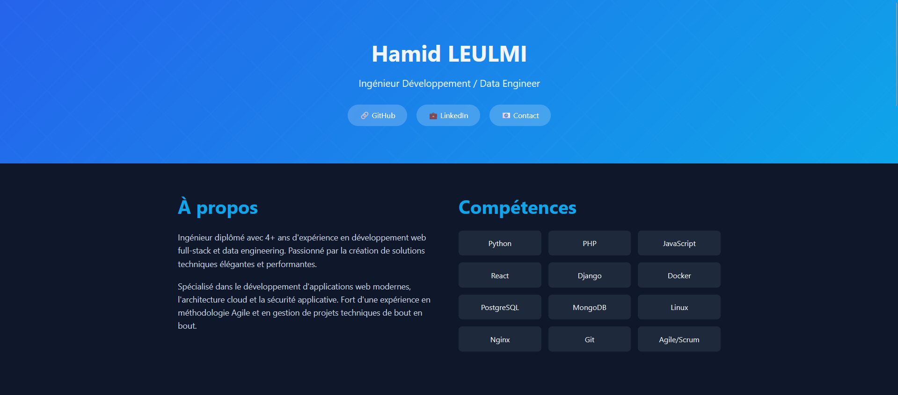
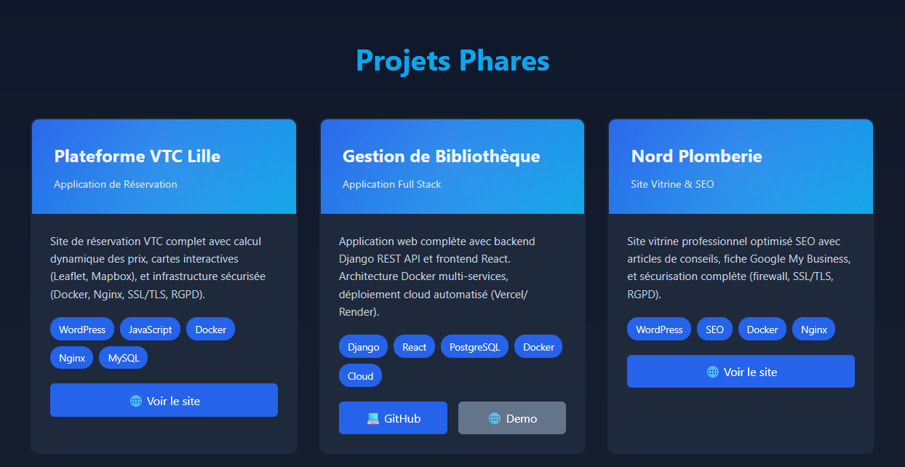
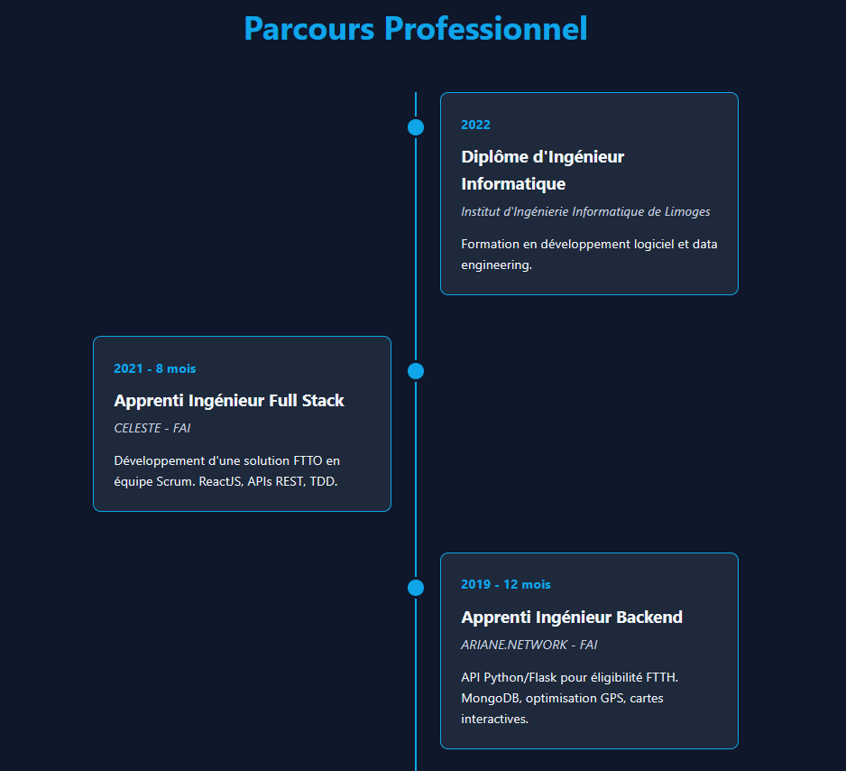

# 🚀 Portfolio - Hamid LEULMI

> Modern portfolio website showcasing my projects and skills as a Software Engineer / Data Engineer

## 🌐 Live Site

**[hamid-lmi.github.io](https://hamid-lmi.github.io)**

## 🎨 Preview

### Homepage & Skills

### Projects Showcase

### Professional Timeline

## 📋 About

Personal portfolio website featuring:
- **Project showcase** with live demos and GitHub links
- **Professional timeline** of my career journey
- **Technical skills** overview with key technologies
- **Responsive design** optimized for all devices

## 🛠️ Built With

- **HTML5** - Semantic markup
- **CSS3** - Modern styling with animations and transitions
- **GitHub Pages** - Free hosting and deployment

## ✨ Features

- 🎨 Modern dark theme with gradient accents
- 📱 Fully responsive design
- ⚡ Smooth animations and hover effects
- 🔗 Direct links to live projects and repositories
- 🎯 Clean and professional UI/UX
- 🌐 SEO optimized

## 📂 Projects Highlighted

- **VTC Booking Platform** - WordPress, Docker, MySQL, Leaflet.js ([Live](https://itim-vtc-lille.fr/))
- **Library Management System** - Django, React, PostgreSQL ([GitHub](https://github.com/Hamid-LMI/library_project))
- **Business Website** - WordPress, SEO optimization ([Live](https://nord-plomberie.fr/))
- **FTTH Eligibility API** - Python/Flask, CakePHP, JQuery, MongoDB
- **FTTO Platform** - React, Slim PHP, TDD

## 📫 Contact

- **LinkedIn**: [linkedin.com/in/hamid-leulmi](https://linkedin.com/in/hamid-leulmi)
- **GitHub**: [@Hamid-LMI](https://github.com/Hamid-LMI)
- **Email**: hamid.leulmi@laposte.net

---

⭐ **Open to new opportunities** - Feel free to reach out!
